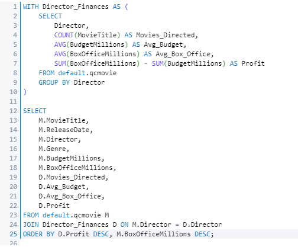
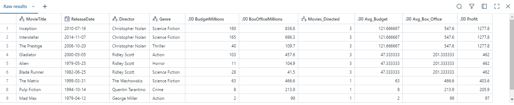
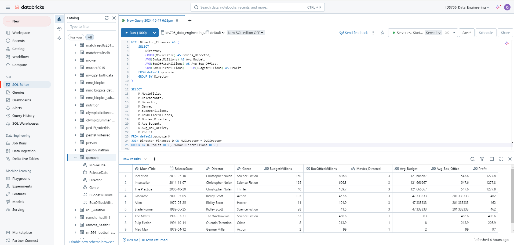

# Complex SQL Query for a MySQL Database

## Introduction

This project demonstrates the application of complex SQL queries involving joins, aggregation, and sorting. It provides a practical example using a movies dataset where financial statistics are aggregated per director, and then joined with movie details. The purpose is to analyze the financial performance of directors based on the movies they have directed.

## CI/CD Pipeline

This project uses GitHub Actions for CI/CD, automating tests and ensuring code quality upon pushes or pull requests to the `main` branch. The workflow includes:

- **Setup**: Runs on Ubuntu, with the project environment set up using Python 3.9.
- **Dependencies**: Installs all required packages via `make install`.
- **Code Quality**: Formats and lints the code using `make format` and `make lint`.
- **Testing**: Executes tests (`make test`) with secure environment variables from GitHub Secrets, ensuring connectivity to necessary services without exposing sensitive information.

This streamlined CI/CD process guarantees that all changes meet quality standards and function correctly within the production environment.

### SQL Query

### Query Results

## SQL Query Explanation

The SQL query designed for this project performs a series of complex operations aimed at analyzing financial metrics of movies directed by various directors. Here's what each part of the query accomplishes:

1. **Aggregation (CTE - `Director_Finances`)**: This Common Table Expression (CTE) aggregates critical financial data for each director:
   - **Movies Directed**: Counts the total number of movies each director has been involved with.
   - **Average Budget**: Calculates the average budget allocated for the movies directed by each director.
   - **Average Box Office**: Determines the average box office revenue generated by their movies.
   - **Profit**: Computes the net profit for each director by subtracting the total budgets from the total box office revenues.

2. **Join**: The main query joins the aggregated data from the CTE with the original movies table (`qcmovie`). This allows for enriching the movie details with the aggregated financial statistics from the CTE.

3. **Sorting**: The final results are sorted in two layers:
   - **Primary Sort**: By total profit for each director, showcasing which directors have generated the most profit from their movies.
   - **Secondary Sort**: Within the same director category, movies are sorted by their individual box office revenues in descending order.

### Insights Provided

The query offers valuable insights into:
- The financial success of directors, highlighting who are the most profitable based on their cinematic contributions.
- The economic impact of directors in the film industry, providing a detailed breakdown of budgeting and revenue generation across their portfolio.
- Strategic data that can help movie studios and producers make informed decisions regarding which directors might yield higher returns on investment.

### Expected Results

The expected result of this query is a detailed list of movies, enriched with financial performance metrics per director. This allows us to see not only which movies have been the most profitable but also which directors have been the most financially successful.

## Query Functionality

- **Aggregates data** from multiple columns including budgets and box office revenues.
- **Joins** aggregated data with the main movie table to provide enriched movie records.
- **Sorts** the final output to highlight top-performing directors and movies based on profitability and revenue.

## Screenshots

Here are screenshots of the SQL query in the Databricks environment and the results produced:

